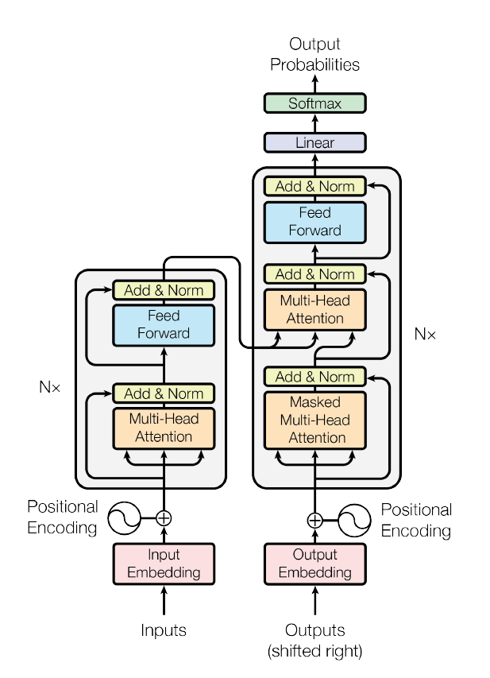
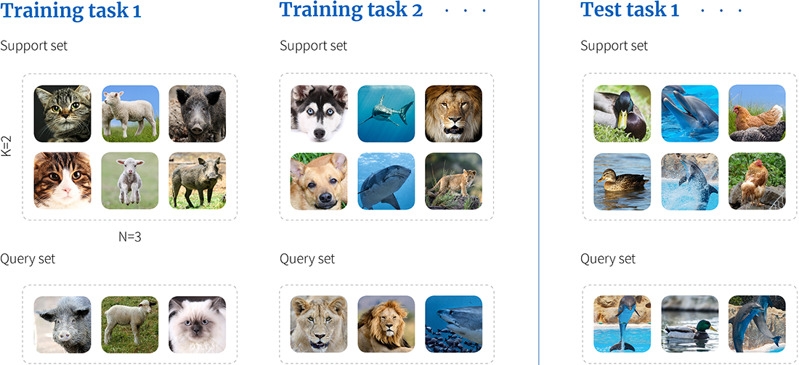
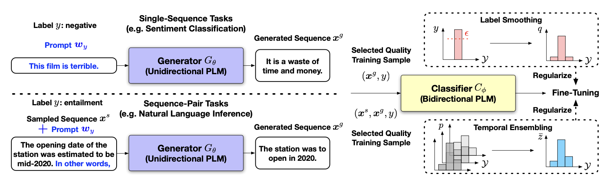
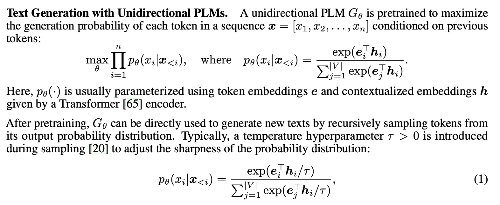
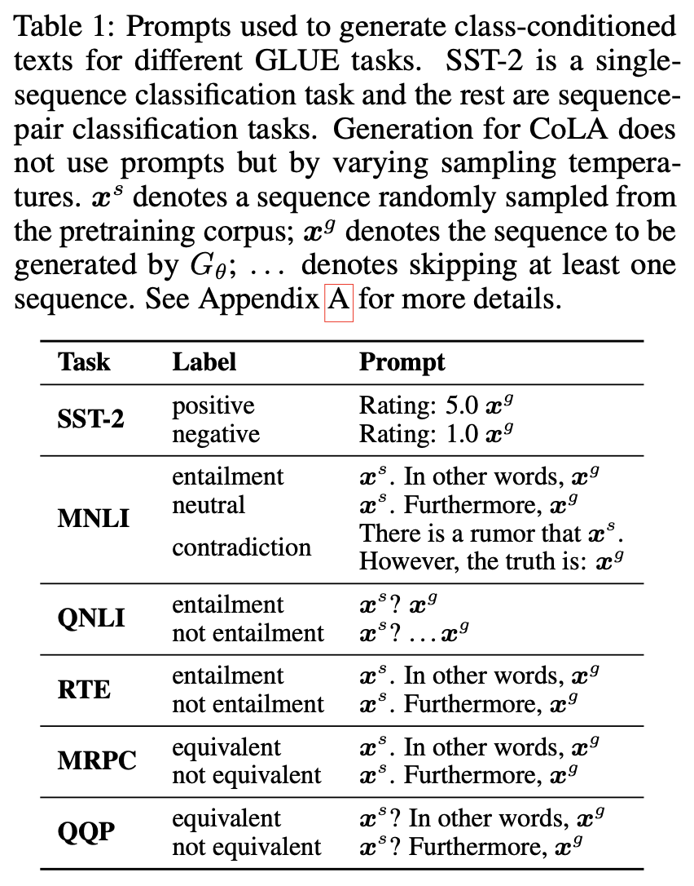
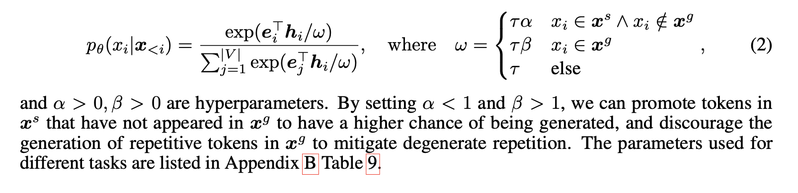
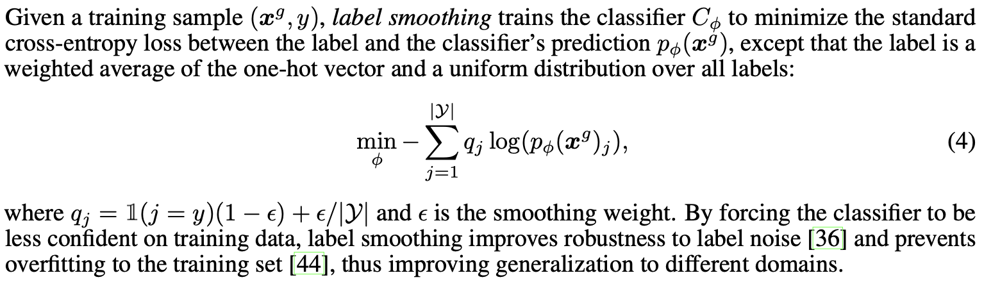
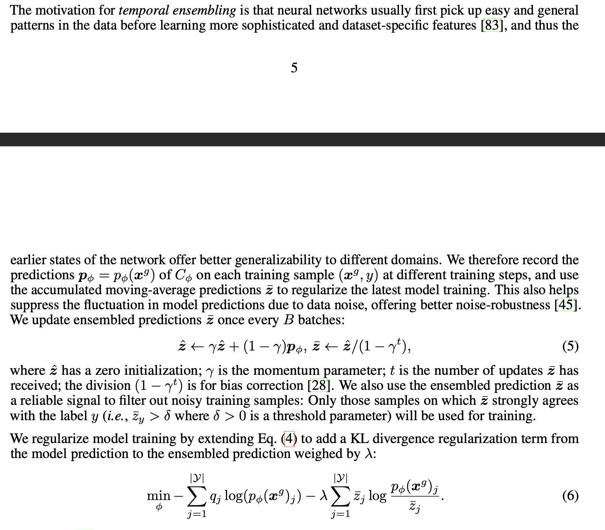

Firstly, what we introduce:

1. unidirectional PLM, AKA auto-regression model
2. bidirectional PLM, AKA auto-encoding model
3. few-shot
4. prompting method in NLP
5. zero-shot

Secondly, we could talk about what they did:

1. auto-regression model  generates class-conditioned training dataset.
2. auto-encoding model fine-tune the model based on generated prompting.

Thirdly, we could compare SuperGen to other model which uses zero-shot:

1. moderate the model size
2. no need annotation. Existing zeros-shot methods do not use any form of training data from the test domain (but may train on other domains) and directly perform inference on the target task.

Lastly, discuss the keys for working well:

1. selecting quality training dataset. (details in paper)
2. using label smoothing and temporal ensemabling to regularize fine-tuning on generated data.

## First part -- prerequisites

### 1.1 autoencoding vs autoregressive

Transformers consists of Encoder and Decoder

Encoder: AKA bidirectional or auto-encoding

Decoder: AKA unidirectional or auto-regressive

Why:

1.  in the transformers encoder, the process of handling the previous token and following token are simultaneous. Every token could read the information from start to end of the input and the information from end to the start of the input. Its function looks like bi-LSTM. It is good at NLI task. Since it could tackle the information from both side.
2. in the transformers decoder, the subsequent token must wait until the previous ones have been processed. It's good at Text Generation. Because people write anything from left to right.

auto-encoding model: BERT, RoBerta, AlBert, XLNET.

auto-regressive model: GPT, Transformer-XL.

hybrid model: BART, T5, UniLM

### 1.2 few-shot learning

https://www.borealisai.com/research-blogs/tutorial-2-few-shot-learning-and-meta-learning-i/

Few-shot learning refers to the ability of learning new concepts by training machine learning models with only a few examples. Few-shot learning is usually studied using *N-way-K-shot classification*.

in the below figure, we use one set of classification problems to help solve other unrelated sets.

Figure 1. An algorithm is trained using a series of training tasks. Here, each task is a 3-way-2-shot classification problem because each training task contains a support set with three different classes and two examples of each. During training the cost function assesses performance on the query set for each task in turn given the respective support set. At test time, we use a completely different set of tasks, and evaluate performance on the query set, given the support set. Note that there is no overlap between the classes in the two training tasks {cat, lamb, pig}, {dog, shark, lion} and between those in the test task {duck, dolphin, hen}, so the algorithm must learn to classify image classes in general rather than any particular set.

**IN NLP**

The most strict few-shot learning setting does not assume access to any unlabeled data or large validation sets for hyperparameter tuning, where prompt-based methods are prominently deployed to inject task descriptions into PLMs and make effective use of their language modeling capability for improved training data efficiency in low-data regimes. 

### 1.3 prompting 

A prompt refers to a text input that is given to a model to elicit a specific response or output. The prompt acts as a guide, instructing the model on what type of information or response is required.

Imagine such a scenario that you train a model for the NER task today, you will be asked to do a text generation task tomorrow, what's more, you will be asked to do a QA bot, and so on. Every day all you need to do is training different models again and again. 

Prompt could be considered as an auxiliary sentence which help generalize model to have different ability.
for example: 

1. Please rate this movie. + input
2. Please answer the following question. + input

after training, the model will know which task it will tackle based on the prompt.

### 1.4 zero-shot

Zero-shot learning is a much more challenging setting with absolutely no access to any task-specific data. When prompt-based methods are directly used to obtain predictions from PLMs without any training, their zero-shot performance can be much worse —difficult NLU tasks can be barely formulated as prompts that resemble the format of pretraining data, posing great challenges for PLMs to accurately interpret and leverage the prompts without given any training samples. 

The current mainstream of zero-shot learning is based on transfer learning: By converting a set of tasks with abundant annotations into instruction templates, entailment pairs or question-answer formats and fine-tuning PLMs on them, the PLMs acquire the cross-task transfer ability to execute unseen tasks when they are formulated in a similar format. 

## Second part -- modeling pipeline

### 2.1 overview

label -> prompt

sample text + prompt + unidirectional PLM -> Generated Sequence

Generated Sequence + label + label smoothing + temporal Ensembling -> the result/prediction

Use a unidirectional PLM to generate training data for fine-tuning another PLM on the target task. 

### 2.2 Generateion Data with Unidirectional PLM

#### Prompt

The pre-train model is good enough so that there is no need to fine-tune or update the parameters of it.

There two kinds of prompts (unnecessary to dive in):

1. generate single sequence (SST-2 dataset) 
2. generate sequence pairs (the rest of dataset)

#### Issues:

A common issue in text generation is degenerate repetition where generated texts get stuck in repetition loops.

one approach is to discourage repetition by reducing the logits of tokens that are already in the sequence before performing sampling. In sequence pair generation, however, it is sometimes desirable to encourage the second sequence to repeat some words in the first sentence.

#### Selecting Quality Training Data

Calculate the score based on the above equation. To construct a training set consisting of N samples per class, we will generate more samples (*e.g.*, 10N). Get rid of the remaining 9N samples, only keep the most highest score samples.

### 2.3 fine-tune 

Even with the above training data selection procedure, the resulting training set may still contain noise and there exists domain difference from the downstream tasks.

#### label smoothing

#### temporal ensembling

## hird Part -- Pros and Cons:

### Pros:

1. Moderate size of Model
2. Removing the need for a large amount of cross-task annotations
3. Eliminating the task difference in training and inference
4. Different from previous studies that rely on labeled data to fine-tune the generative PLM, we directly use prompts to guide data generation without fine-tuning

### Cons:

	1. the lack of access to task-specific samples for hyperparameter tuning
	1. the generated training data quality may not be high enough to achieve good performance on challenging tasks, especially when the task distribution is significantly different from the pretraining data distribution.

